https://chatgpt.com/c/6924bd28-807c-832b-9443-d63d29b7d3b3

# Pipeline Sketch and Present PET Status

> [!NOTE]  
> 
> The goal of this project is to develop classical (non–machine-learning) workflows for detecting, analyzing, and rectifying millimeter graph paper grids in ordinary laboratory photographs. Solutions must rely exclusively on deterministic computer vision, geometry, and signal-processing methods, with no neural networks.
> 
> **Key Modules**
> 
> - `pet_allinone.py`
> - `pet_allinone_v2.py`
> - `pet_glare.py`
> - `pet_grid_node_detector.py`
> - `pet_grid_node_detector_ikde.py` 
> - `pet_imagej_lcn.py`
> - `pet_imagej_ridge_detector.py` (defective draft)
> - `pet_kde_interactive.py`
> - `pet_kde_interactive_v2.py` 
> - `pet_preprocess.py`
> - `pet_segmentation_composite.py`
> - `pet_segmentation_composite3.py`
> - `pet_segmentation_grabcut.py`
> - `pet_segmentation_hsv_s_mask.py`
> - `pet_segmentation_lab_a_mask.py`
> 
> For earlier brainstorming see: [Preliminary Pipeline Notes](https://chatgpt.com/c/6915c9bb-ec70-832a-94a1-560ec524b942).
> 
> See [Review/README.md]

## 1. High-Level Workflow

1. **Preprocessing**
    - Image enhancement
    - Illumination correction
    - ==Grid-targeted local contrast normalization==
    - Noise management / denoising
2. **Grid Detection**
    - Segment detection (line-based)
    - Node detection (intersection-based)
    - Ridge detection
3. **Raw Grid Data Filtering**
    - Cleanup, outlier removal
    - Robust centering, rotation, and scale normalization
4. **Statistical Node Set Validation**
    - Determine whether node distribution is statistically consistent with a (possibly distorted) square grid
    - See [notes](./STAT_ANALYSIS.md)
5. **Grid Data Analysis**
    - Orientation estimation
    - Pitch estimation
    - Grid-aligned bounding box detection
    - Distortion analysis
6. **Downstream Tasks**
    - Metric scale extraction (px/mm)
    - Distortion correction
    - [Segmentation](./SEGMENTATION.md) + sample extraction (possibly performed before distortion correction)
    - Sample length/area measurement
    - Integration into further computational pipelines

## 2. Preprocessing

Preprocessing addresses three major objectives critical for grid extraction:
- **Illumination normalization** (remove global gradients, vignetting, shadows)
- **Local contrast enhancement** (extract grid lines even under low SNR)
- **Noise management** (prevent noise amplification during contrast boosting)

### 2.1 Illumination Correction

The preliminary preferred tool is the Retinex family (Multi-Scale [Retinex](https://imagej.net/plugins/retinex), [DI-Retinex](https://arxiv.org/abs/2404.03327), and [Fiji ImageJ Retinex](https://github.com/fiji/Fiji_Plugins/blob/main/src/main/java/Retinex_.java)). Note, [Fiji ImageJ](https://fiji.sc) Retinex is distributed as JAVA source  code which needs to be compiled with JDK for use in Fiji ImageJ; [compilation script and instructions](https://github.com/pchemguy/GeomPrimitive/tree/dev/primitives/src/pet/Fiji%20Retinex) can be obtained from Gemini / ChatGPT.

Other methods also exist (rolling-ball, large-kernel homomorphic filtering, morphological background estimation), but Retinex remains the most robust candidate for technical (non-aesthetic) illumination normalization.

Because grid detection is the primary downstream target, we must prioritize methods designed for:
- Scientific / technical imaging,
- Robustness to uneven lighting,
- Preservation of structural detail,
- Tolerance to glare and partial occlusions.

If Retinex proves sufficiently robust, implementing a Python-native version may be worthwhile.

### 2.2 Local Contrast Normalization (LCN)

Local contrast normalization is essential for improving gridline detectability when the grid is:
- faint,
- partially occluded,
- affected by plastic glare or uneven illumination.

Note, `pet_imagej_lcn.py` use ImageJ to apply local contrast normalization.

#### OpenCV CLAHE (Contrast Limited Adaptive Histogram Equalization)

CLAHE is a strong candidate for inclusion in the enhancement pipeline. It is locally adaptive and can improve fine structures like grid lines. The parameter-space interaction with noise amplification, illumination gradients, and node-detection success needs careful evaluation. See additional notes ([LCN](./Local Contrast Normalization) and [ref](https://chatgpt.com/c/6915c9bb-ec70-832a-94a1-560ec524b942)).

#### Fiji ImageJ - Normalize Local Contrast

Currently used preprocessing:  
**Fiji ImageJ → Plugins → Integral Image Filters → Normalize Local Contrast (40×40×5.00 / center / stretch)**

This approach produces clean grid visibility and is the current baseline.

## 3. Grid Detection

Two complementary strategies are under development:
1. Segment-based detection (via LSD)
2. Node-based detection (via Sobel + intersection analysis)

These approaches can be fused for maximal robustness.

> [!WARNING]
> 
> ImageJ Ridge Detector is way better than OpenCV LSD, though I could not find a way to get metadata (ResultsTable with per node metas) via Pyton.  
> See also  
> - https://github.com/thorstenwagner/ij-ridgedetection
> - https://github.com/lxfhfut/ridge-detector
> - https://scikit-image.org/docs/0.25.x/auto_examples/edges/plot_ridge_filter.html
> - https://github.com/clEsperanto/pyclesperanto

### **Deep Research Prompt for Reviewing Grid Detection Libraries** 

https://chatgpt.com/c/692de722-b510-8332-bfce-4be61696fea3  
https://gemini.google.com/app/95029513ccf58826  

I need a comprehensive review and detailed technical analysis of various prominent open source Python libraries or tools accessible from Python that expose functionality suitable for analysis/detection/extraction of grids due two background millimeter graph paper in lab photographs. I am specifically interested in this grid-related functionality and analysis/review shall specifically focus on it.

#### Preliminary thoughts

Perhaps, the first candidate tool is OpenCV LSD. It is readily available and after appropriate pre/post processing yields usable information. However, its readily available crippled implementation, though useful, appears to perform considerably worse compared to Fiji ImageJ's Ridge Detector. Then again, ImageJ Ridge Detector is Java library with a lousy Python interface. The general task of detecting curves, not necessarily straight lines, is an important task for biomedical applications, so other prominent libraries targeting either general scientific or more specific biomed apps provide similar functionality, be it called "Ridge Detector" or something else. I am specifically interested in algorithmic (non-ML) solutions, but I am interested in both CPU and GPU-accelerated libraries.  

I am less concerned about speed now, but accuracy, noise and limited contrast robustness, and integrated multiscale abilities with robust auto tuning are important. Also important is returned metadata for assessing individual lines/curves (width, contrast, etc.), integrated ability to handle line crossing, tendency to generate longer polylines, integrated refinement abilities.

#### Gemini Plan

1) Research Python implementations and wrappers of Steger's curvilinear structure detection algorithm (the basis of ImageJ's Ridge Detector) to find native Python alternatives or efficient bindings.
2) Analyze the technical specifications and limitations of OpenCV's Line Segment Detector (LSD) and Fast Line Detector (FLD) modules, specifically looking for recent updates, forks, or non-mainstream bindings that address known implementation limitations regarding grid extraction reliability.
3) Investigate Scikit-image's ridge operators (Frangi, Sato, Meijering, Hessian) and skeletonization algorithms, evaluating their ability to extract vector topology from low-contrast millimeter graph paper grids compared to direct vector extraction methods.
4) Explore biomedical image analysis libraries accessible in Python (e.g., SimpleITK, Mahotas, CellProfiler) for 'tube', 'vessel', or 'neurite' detection algorithms that operate non-ML and can be repurposed for robust grid line extraction.
5) Search for GPU-accelerated Python image processing libraries (such as cuCIM, CuPy, or Kornia) that offer algorithmic line or ridge detection functions suitable for high-throughput grid analysis.
6) For each identified library, evaluate the availability of specific metadata extraction features: line width estimation, local contrast measurement, handling of line crossings (junctions), and robust connectivity analysis (polylines vs. segments).
7) Compare the multiscale processing capabilities and auto-tuning robustness of the identified tools, focusing on their performance with noisy backgrounds and varying lighting conditions typical of lab photographs. 
8) Synthesize the findings into a technical review, categorizing tools by their underlying algorithmic approach (gradient-based vs. Hessian-based vs. morphological) and ranking them based on accuracy, metadata richness, and ease of Python integration.
### 3.1 Segment Detection

The current prototype is implemented in **`pet_allinone.py`**, supported by the `pet_*` module family. It displays multiple debug plots and saves intermediate results (`debug_*`, `rotated_*`).

#### LSD (Line Segment Detector)

The detector uses OpenCV’s `cv2.createLineSegmentDetector`.

Important implementation notes:
- Standard pip/Conda distributions do not include advanced LSD variants (no refinement modes; limited metadata).
- Segment “width” metadata is available but less stable without opencv-contrib builds.
- A custom build of OpenCV + opencv-contrib may be necessary.

LSD returns:
- A list of detected segments
- A corresponding array of segment widths

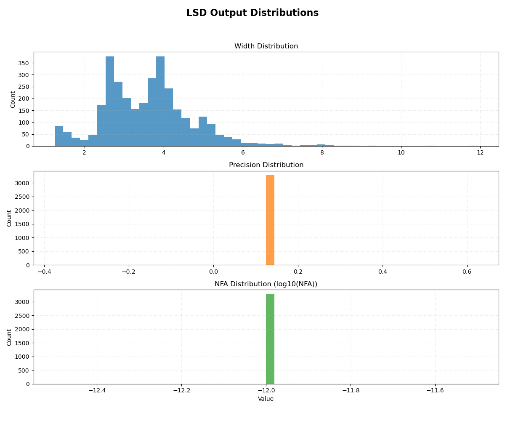
**Figure. Sample LSD Metadata Distribution**: Due to standard limited functionality, precision and NFA data is not collected. Conservative filtering may involve dropping excessively thick lines (say, top 1-5 %) and very short lines, say shorter than 2-4 pixels. Length filtering may also be attempted on bottom 1-5%, but the long tail must be kept as grid line detection may yield long segments and generally broad length distribution depending on image quality and grid size and distortions.

##### Filtering Guidelines

- Drop abnormally thick segments (top ~1-5%)
- Drop very short segments (< 2-4 px)
- Preserve broad length distribution, as real gridline detection may yield long segments.

### 3.2 Major/Minor Grid Separation

Millimeter graph paper contains:
- Major gridlines (e.g., 5 mm spacing; thicker)
- Minor gridlines (e.g., 1 mm spacing; thinner)

#### Width Distribution Analysis

Line-thickness histogram should be bimodal under reasonable image quality.

Implementation:
    - **Module**:`pet_lsd_width_analysis.py`
    - **Key Methodology:**
        - `GaussianMixture` from `sklearn.mixture` 
        - `gaussian_kde` from `scipy.stats`
        - Clustering is based on metadata returned by `GaussianMixture` analysis.

Major lines are typically:
- 1.5x to 3x thicker than minor lines
- More reliably detected
- Better suited as anchor geometry for early analysis

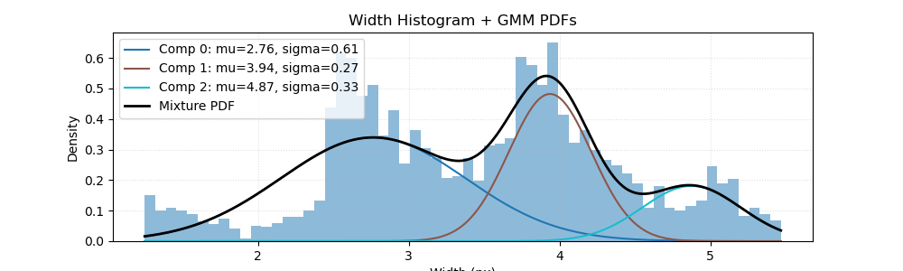
**Figure. Sample LSD Metadata Width (Line Thickness) Distribution Analysis**

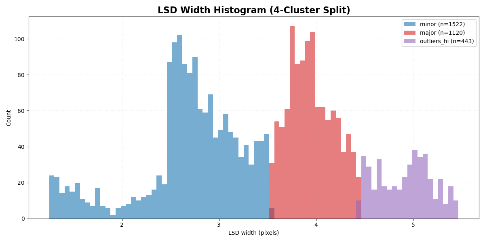
**Figure. Sample LSD Metadata Width (Line Thickness) Distribution Separation**

#### Orientation Analysis

Orientation distribution should also be bimodal, separated by ~90° (plus distortion).

Implementation:
    - **Module**:`pet_geom.py`
    - **Key Methodology:**
        - Uses custom AI generated algorithm. ==TODO==: revisit code, analyze algorithm, add clear explanation.

Outputs include:
- Peak detection
- Circular mean
- Circular variance
- Resultant length
- von Mises κ
- Split angle and rotation angle

This produces robust X/Y separation without any manual parameters.

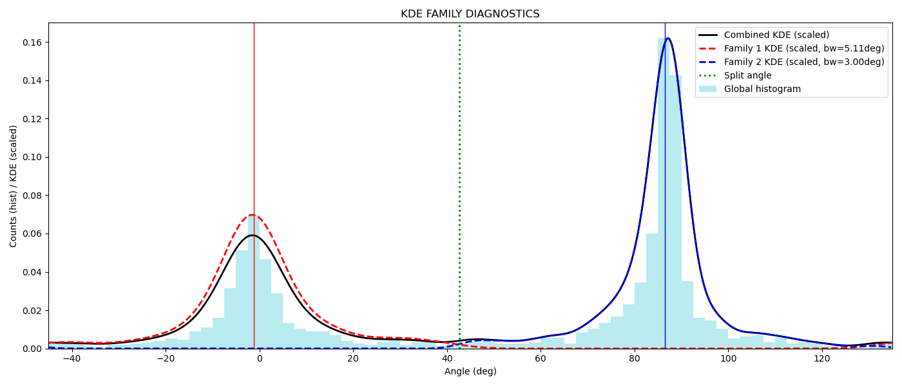
**Figure. Sample LSD Segment Orientation Distribution**

**Sample angle orientation analysis report:**

```
====================================================================
  ANGLE ANALYSIS REPORT
====================================================================
Angle range            : [-45.0deg, 135.0deg]
Total segments         : 1563
Total weight           : 1.000                                                                                                                                                         
Detected peaks (deg)
-------------------
  Peak 1               : -1.250
  Peak 2               : 86.500
  Split angle          : 42.625
  Rotation (deskew)    : 3.500 deg

FAMILY 1
--------
  Count                : 589
  Total weight         : 0.377
  Mean angle (deg)     :   -0.292
  Circular variance    :    0.038
  Resultant length R   :    0.962
  Kappa (von Mises)    :   13.469
  KDE bandwidth (deg)  :    5.113
  Skewness             :   -0.692
  Kurtosis             :  -21.739
  Effective N          :    589.0

FAMILY 2
--------
  Count                : 974
  Total weight         : 0.623
  Mean angle (deg)     :   85.883
  Circular variance    :    0.019
  Resultant length R   :    0.981
  Kappa (von Mises)    :   27.019
  KDE bandwidth (deg)  :    2.998
  Skewness             :    7.016
  Kurtosis             : -5396.895
  Effective N          :    974.0

====================================================================
```

### 3.3 Segment Centers

Once major segments are isolated and X/Y families split:

- Replace each segment with its center point (more stable than endpoints)
- Rotate dataset using estimated orientation for normalization
- Use as primary input for gridline statistical analysis

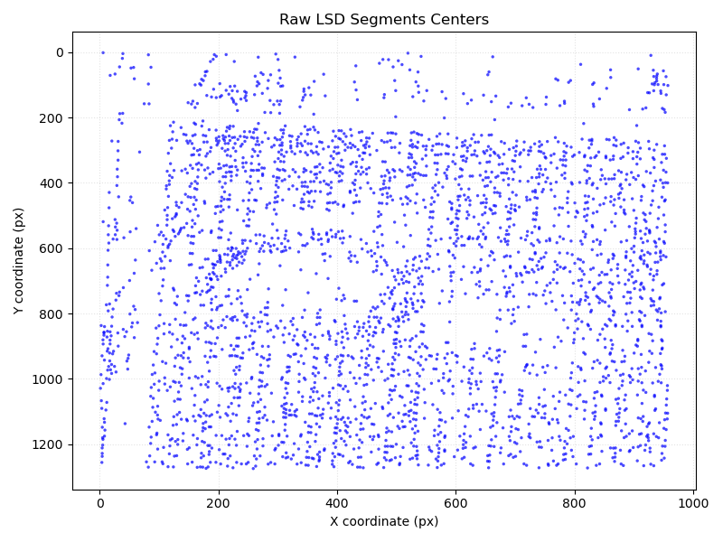
**Figure. Raw LSD Segment Centers.** "Landscape" orientation. Grid line patterns a clearly observable with slight CW rotation off the vertical position.

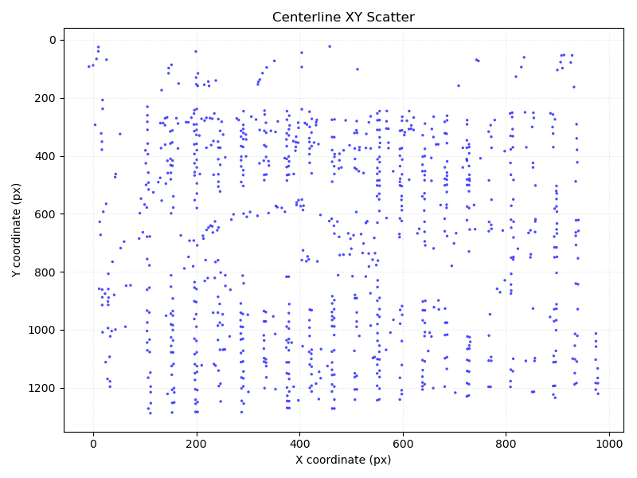
**Figure. Representative LSD Segment Centers Family After Thickness and Orientation Separation.** Note, this set has also been rotated using angle obtained from angle distribution analysis. This "Landscape" family clearly exhibits grid structure in vertical direction.

## 4. Node Detection

Node detection (`pet_grid_node_detector.py`) uses:
1. Sobel operator to extract gridline families
2. Intersection analysis to find candidate intersection nodes

Current limitation: a manually tuned parameter `k_len` (~40–70% of expected spacing).

Hardcoded value must be replaced with fully automatic selection, likely via:
- multi-scale Sobel response statistics,
- adaptive thresholding,
- hierarchical pitch scanning.

See [notes](./GRID_NODES_DETECTION.md).

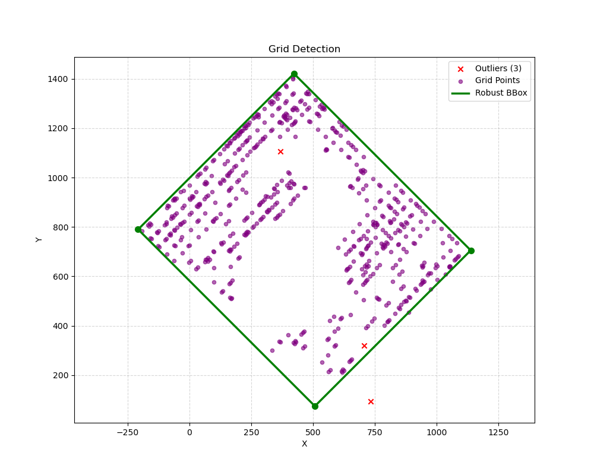
**Figure. Grid Node Detection** (Note, the shown image also include identified grid-aligned bounding box.)

## 5. Grid-Aligned Bounding Box

The experimental implementation (`pet_grid_auto_crop.py`) detects approximate grid-aligned bounding boxes and is not yet integrated into the main pipeline.

## 6. Grid Data Analysis

Two classes of approaches have been explored:
1. Black-box solvers ([AI-generated prototypes](https://gemini.google.com/app/1cd765eae3be9bdb))
2. High-level statistical analysis (more principled and robust)

Additionally, asking whether the obtained node set is [statistically consistent](./STAT_ANALYSIS.md) with square grids (possibly distorted), makes sense for an ML-free analysis workflow (presently not implemented).

### 6.1 “Black-Box” Solvers (Initial Prototypes)

```
pet_period.py
pet_grid_solver_extended.py
pet_grid_postprocessor.py
pet_grid_solver_xy.py
```

These are functional but ad hoc, lacking transparency.

### 6.2 Statistical Grid Pitch Estimation

There is apparently a robust approach to estimating grid pitch via statistical analysis of distance distributions to nearest neighbors. A few variants have been implemented in `pet_grid_optimizer.py and `pet_grid_nodes_bbox.py`. See code for further details.

### 6.3 Bounding Box Detection

With estimated pitch, there is also apparently a robust algorithm for detecting grid-aligned bounding box (see `pet_grid_nodes_bbox.py`).

### 6.4 KDE-Based Marginal Density Representation

#### Key Idea

Project all grid nodes onto the x-axis.

Then compute a Gaussian KDE over this 1D distribution.
- When the grid is misaligned, the projection smears points uniformly - near-flat density (noise floor).
- When the grid is aligned, nodes from each vertical gridline cluster together - sharp peaks at the pitch frequency.

This produces a resonant signature of alignment.

#### Behavior at Different Angles

As the node cloud is rotated:
- KDE transitions from flat -> peaked
- Peaks correspond to true grid pitch


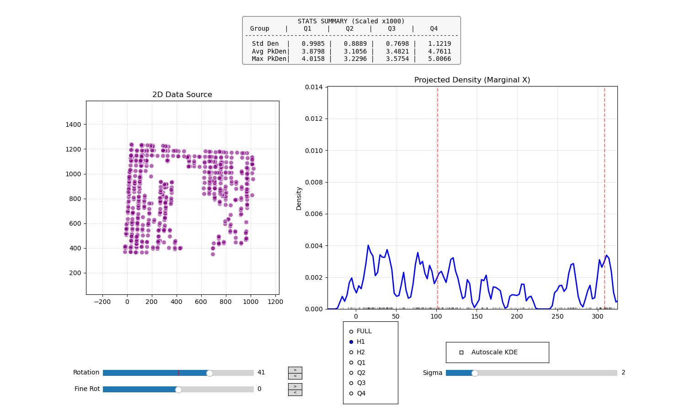

**Figure. Real Grid Node Cloud Representations - Misaligned.** Left panel shows a conventional XY scatter plot. A large portion of the grid node is missing due to sample occlusion and plastic-file-related glares. Right panel shows half of the KDE plot. The cloud node is slightly misaligned and the associated KDE spectrum is effectively noise floor.

However, when grid lines become vertical, all nodes on those aligns project very closely (the same point for ideal grids), resulting in sharp peaks and dip valleys:

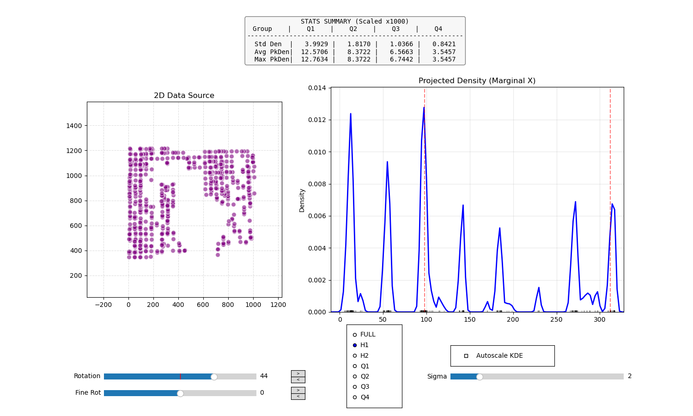
**Figure. Real Grid Node Cloud Representations - Aligned.** Same visual as above, except the node cloud is turned by 2 deg and is aligned. KDE spectrum demonstrates typical resonant behavior.

#### Why this works

For an ideal square grid:
- Rotated ~ homogenized projection -> noise-like
- Aligned ~ vertical lines project to single x-values -> sharp peaks
- Peak spacing = true pitch
- Peak intensity ∝ number of contributing nodes

This appears to be robust with respect to moderate distortion and partial grids.

#### Characterizing Grid Distortions

This method has a resonant-like nature and is quite sensitive to grid distortions to the point that when one side is aligned the other might be completely misaligned, revealing even moderate grid distortions.

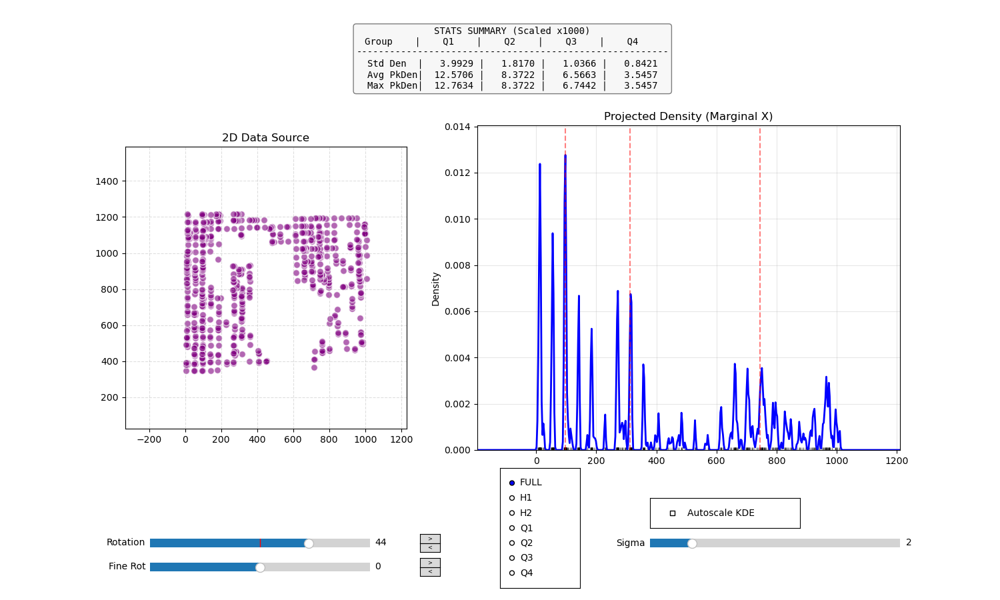
**Figure. Real Grid Node Cloud Representations - Aligned - Full.** Same visual as above, except showing the full KDE spectrum on the right. While the left part of the spectrum (and left part of the node cloud) is "in focus", the left part is not.

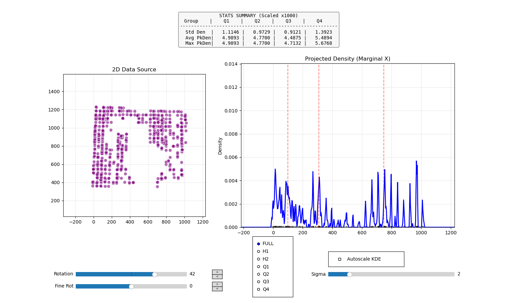
**Figure. Real Grid Node Cloud Representations - Aligned - Q4.** Same visual as above, except the cloud is rotated by 2 deg, and the picture is opposite, with right part being in focus and left being out of focus. Note, because line intensity is directly proportional to the number of contributing points and the right part of the cloud misses considerably more points, their intensities are correspondingly weaker. But the lines are still quite sharper.

## 7. Automatic Angle Tuning (Resonance Maximization)

We need a robust scalar quantity that is:
- maximized or minimized when peaks sharpen
- stable under missing data
- applicable to subsections (quartiles) of data

Promising quantities:
- Standard deviation of KDE (peakedness)
- Shannon entropy (minimized at resonance)
- Gini coefficient (maximized at resonance)
- Peak–valley contrast metrics

The following figures illustrate full 360 deg sweeps of these quantities. The full range was split into four quartiles, and for each a sweep has been calculated.  

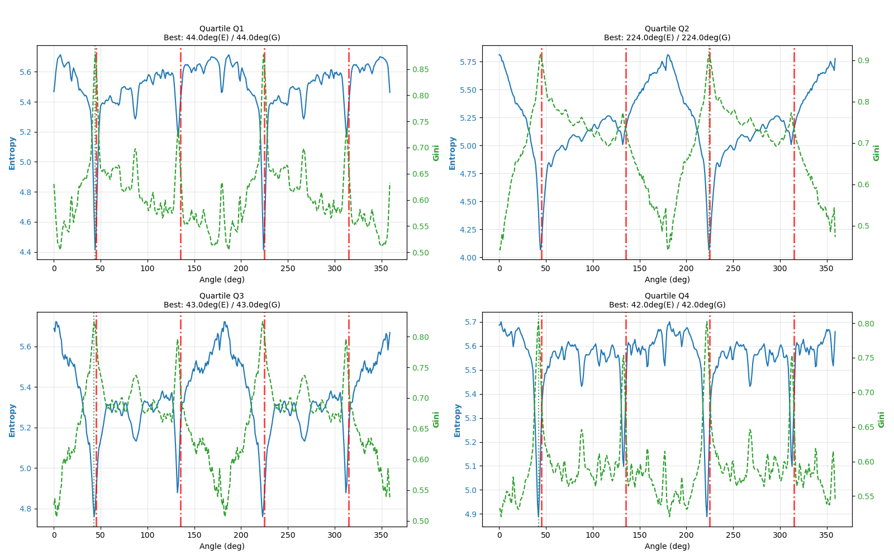
**Figure. Entropy ang Gini Sweep Plots.** The four panels show how Shannon entropy and the Gini coefficient change for each of the four quartiles as the node cloud performs a full turn.

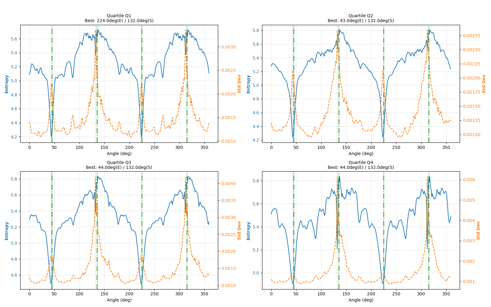

 **Figure. Entropy ang Gini Sweep Plots.** Same as above, except the Gini coefficient is replaced with standard deviation of KDE signal.

For an ideal square grid, four dominant resonances should be observer every 90 deg corresponding, for example, to successive orientation of a particular side down (or any other direction). Because there are actually just two families of grid lines (X/Y) the two pairs of resonances spaced 180 deg apart correspond to the same family oriented vertically. For a distorted grid, however, each nominal orientation will have a range of "resonant" angles, as illustrated above. In such a case, nominally 180 deg apart positions may not necessarily correspond to optimally aligned state (for example, consider trapezoidal distortion). For real grids, all four nominal orientations should be analyzed, and this information then can be used for distortion characterization and, possibly, rectification.

## 8. TODO and Notes

### 8.1 General

- Note how LSD-based segment centers cloud exhibits clearly grid structure (stripes) in one direction, but not the other (at least much more pronounced). Direct fitting via `pet_grid_optimizer.py` and related modules also results in much better results in one direction. Interactive `pet_grid_node_detector.py` script detecting grid nodes based on Sobel operator followed by KDE-based marginal density representation also show strong asymmetry in resonance intensity. 
- Consider generating KDE from horizontal slices, say top/mid/bottom one third of Y spread for each orientation.
- [WEIGHTED_KDE](./WEIGHTED_KDE.md)
- Preliminary comparison using the same workflow of LSD-based and Sobel-edge-detector-based (as implemented in `pet_grid_node_detector.py` and demonstrated via `pet_allinone_v2.py`) suggests that LSD-based analysis may yield broader lines resulting in considerable reduction in sensitivity to geometrical distortion of the grid. Due to this reduced sensitivity, average pitch detection might be more robust, but LSD-based detection might be less suitable to characterizing grid distortions. These conclusions are based on a single image analysis and proper evaluation of both approaches is essential. 
- Minimum grid pitch estimation as `10 * (pw_major + 1.5 * pw_minor) / 2`, where `pw_major` and `pw_minor` KDE peak width for corresponding `widths` distributions.
- Revisit code of orientation/angle distribution analysis in `pet_geom.py`, analyze algorithm, add clear explanation.

### 8.2 Important Fiji ImageJ Features

- Plugins -> Integral Image Filters -> Normalize Local Contrast
  Defaults: 40x40x3.00 center/stretch
- Image -> Color -> Retinex
- Plugins -> Retinex
  Defaults: Uniform/240/3/1.2
- Process -> Find Edges
- Process -> Image Calculator
- Process -> Calculator Plus
- Process -> Enhance Local Contrast {CLAHE}
  Defaults: 127/256/3.00/None
- Plugins -> Process -> Find Connected Regions
- Plugins -> Ridge Detection
- Plugins -> Segmentation
- Plugins -> Segmentation -> Color Clustering
  Color Clustering on the Brightness Channel appears to be very efficient at splitting the image based on lighting levels. Basically, created split might be then useful as a mask for correction of uneven lighting (check out how this can be done in ImageJ).
- Plugins -> Transform

 