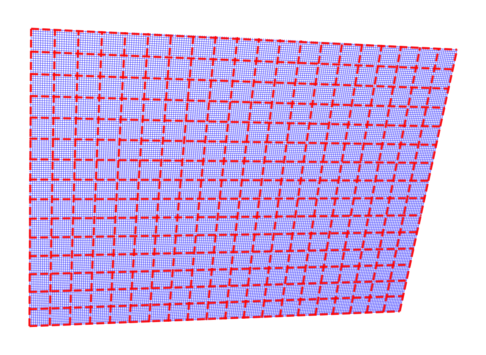

https://chatgpt.com/c/6905add2-1ff8-8328-ba21-6c370614dcc4

Adding a graph-paper coordinate plane as a contextual background with perspective and mild lens distortion.

---

## 🧩 1. Conceptual Layers

You can think of the image as three render layers:

|Layer|Content|Geometry Type|
|---|---|---|
|1️⃣ Background|_millimeter graph paper_|Regular 3D grid → projected to 2D|
|2️⃣ Midground|_hand-drawn shapes / paths_|2D jittered Paths|
|3️⃣ Foreground|_highlights / strokes / labels_|Optional text or overlays|

We’ll focus on **Layer 1**.

---

## 🧱 2. The Grid Geometry

The graph paper is a **2D grid** with:

- **Major lines** every `Δmajor` mm (say 10 mm)
- **Minor lines** every `Δminor` mm (say 1 mm)
- Covering a rectangular region (e.g. 200×150 mm)

Without perspective, you’d just draw:

```python
for x in np.arange(-W/2, W/2, Δminor):
    ax.plot([x, x], [-H/2, H/2], ...)
for y in np.arange(-H/2, H/2, Δminor):
    ax.plot([-W/2, W/2], [y, y], ...)
```

with thicker lines for major divisions.

---

## 🧮 3. Add Perspective: Rotations about X and Y

Represent the grid as a **3D mesh** of points ((X,Y,0)).  
Then rotate it in 3D and project onto the 2D “camera” plane.

### Rotation matrices

For angles $\alpha$ (about X) and $\beta$ (about Y):

$$  
R_x(\alpha)=  
\begin{bmatrix}  
1&0&0\\  
0&\cos\alpha&-\sin\alpha\\  
0&\sin\alpha&\cos\alpha  
\end{bmatrix},\quad  
R_y(\beta)=  
\begin{bmatrix}  
\cos\beta&0&\sin\beta\\  
0&1&0\\  
-\sin\beta&0&\cos\beta  
\end{bmatrix}  
$$

Apply $R = R_y(\beta),R_x(\alpha)$ to every grid point.

---

## 📷 4. Add Perspective Projection

To simulate finite camera distance `f` (focal length):

$$  
x' = f \frac{X_r}{f - Z_r}, \qquad  
y' = f \frac{Y_r}{f - Z_r}  
$$

This gives mild foreshortening and convergence.  
Adjust `f` ≈ 5 – 10 × the grid size for gentle distortion.

---

## 🧰 5. Implementation Sketch

```python
import numpy as np
import matplotlib.pyplot as plt

def make_perspective_grid(W=200, H=150, Δmajor=10, Δminor=1,
                          ax_rot=20, ay_rot=25, f=600):
  """Return projected major/minor grid lines."""
  # angles → radians
  axr, ayr = np.radians(ax_rot), np.radians(ay_rot)

  # 3D rotation matrices
  Rx = np.array([[1,0,0],
                 [0,np.cos(axr),-np.sin(axr)],
                 [0,np.sin(axr), np.cos(axr)]])
  Ry = np.array([[np.cos(ayr),0,np.sin(ayr)],
                 [0,1,0],
                 [-np.sin(ayr),0,np.cos(ayr)]])
  R = Ry @ Rx

  def project(X, Y):
    pts = np.vstack([X.ravel(), Y.ravel(), np.zeros_like(X).ravel()])
    Xr, Yr, Zr = R @ pts
    xp = f * Xr / (f - Zr)
    yp = f * Yr / (f - Zr)
    return xp.reshape(X.shape), yp.reshape(Y.shape)

  # build grid lines in 3D then project
  xs_major = np.arange(-W/2, W/2+Δmajor, Δmajor)
  ys_major = np.arange(-H/2, H/2+Δmajor, Δmajor)
  xs_minor = np.arange(-W/2, W/2+Δminor, Δminor)
  ys_minor = np.arange(-H/2, H/2+Δminor, Δminor)

  lines_major, lines_minor = [], []

  for x in xs_minor:
    X, Y = np.array([[x, x]]), np.array([[-H/2, H/2]])
    xp, yp = project(X, Y)
    lines_minor.append(np.column_stack([xp[0], yp[0]]))
  for y in ys_minor:
    X, Y = np.array([[-W/2, W/2]]), np.array([[y, y]])
    xp, yp = project(X, Y)
    lines_minor.append(np.column_stack([xp[0], yp[0]]))

  # major lines overwrite same method for thicker later drawing
  for x in xs_major:
    X, Y = np.array([[x, x]]), np.array([[-H/2, H/2]])
    xp, yp = project(X, Y)
    lines_major.append(np.column_stack([xp[0], yp[0]]))
  for y in ys_major:
    X, Y = np.array([[-W/2, W/2]]), np.array([[y, y]])
    xp, yp = project(X, Y)
    lines_major.append(np.column_stack([xp[0], yp[0]]))

  return lines_minor, lines_major


# --- demo ---
minor, major = make_perspective_grid(ax_rot=25, ay_rot=15, f=400)
fig, ax = plt.subplots(figsize=(6,4))
for seg in minor: ax.plot(seg[:,0], seg[:,1], color="#aaccff", lw=0.5)
for seg in major: ax.plot(seg[:,0], seg[:,1], color="#3366cc", lw=1.0)
ax.set_aspect("equal"); ax.axis("off")
plt.show()
```

✅ This yields a _graph-paper plane_ rotated and perspectively distorted.

---

## 🔍 6. Lens-Like Distortion (Optional)

You can introduce a mild “barrel” or “pincushion” distortion to mimic camera optics:

```python
r2 = x'**2 + y'**2
x_d = x' * (1 + k1*r2 + k2*r2**2)
y_d = y' * (1 + k1*r2 + k2*r2**2)
```

with `k1 ≈ -1e-7 … -1e-6` for barrel, `+` for pincushion.

---

## 🧠 7. Composition With Your Hand-Drawn Layer

Once you have this grid:

1. Render it **first** (faint blue, thin lines).
2. Overlay your **hand-drawn `PathPatch`** shapes directly — they’ll naturally sit “on the paper.”
3. Optionally apply slight alpha to blend.

Example composition:

```python
minor, major = make_perspective_grid(ax_rot=20, ay_rot=15, f=500)
for seg in minor: ax.plot(seg[:,0], seg[:,1], color="#cfd9ff", lw=0.5)
for seg in major: ax.plot(seg[:,0], seg[:,1], color="#5a7ee0", lw=1.0)
ax.add_patch(handdrawn_shape_from_bbox_patch(-20, -10, 40, 20, "ellipse"))
```

---

## 🧩 1. Why `LineCollection` Fits Perfectly

|Feature|Why it matters for your grid|
|---|---|
|**Batch rendering**|A major/minor grid can easily contain hundreds of lines. `LineCollection` sends them all to the renderer in one go — far faster than calling `ax.plot()` per line.|
|**Consistent style per group**|You can define all minor lines as one collection (same color, width, alpha) and all major lines as another — exactly your intent.|
|**Independent styling**|You can control linewidth, color, alpha, z-order separately for major/minor sets.|
|**Lightweight updates**|You can easily replace grid geometry (`set_segments()`) without rebuilding the artist.|

---

## ⚙️ 2. How It Works

`LineCollection` expects a list (or NumPy array) of segments:

```python
from matplotlib.collections import LineCollection

# segments = [ [(x1, y1), (x2, y2)], [(x3, y3), (x4, y4)], ... ]
lc_minor = LineCollection(
    minor_segments,
    colors="#aaccff",
    linewidths=0.5,
    alpha=0.7
)
lc_major = LineCollection(
    major_segments,
    colors="#3366cc",
    linewidths=1.2,
    alpha=1.0
)

ax.add_collection(lc_minor)
ax.add_collection(lc_major)
```

Each entry in `segments` is one line.  
Everything else (color, width, etc.) is handled uniformly per collection.

---

## 🧠 3. Practical Example — Your Grid Refactored

Here’s your earlier `make_perspective_grid` demo, rewritten to use `LineCollection`:

```python
from matplotlib.collections import LineCollection

minor, major = make_perspective_grid(ax_rot=25, ay_rot=15, f=400)

fig, ax = plt.subplots(figsize=(6, 4))

lc_minor = LineCollection(
    minor,
    colors="#aaccff",
    linewidths=0.5,
    alpha=0.7
)
lc_major = LineCollection(
    major,
    colors="#3366cc",
    linewidths=1.2,
    alpha=1.0
)

ax.add_collection(lc_minor)
ax.add_collection(lc_major)

ax.set_aspect("equal")
ax.axis("off")
plt.show()
```

✅ **Result:**

- Only two draw calls (major + minor).
- Style uniform per set.
- Geometry decoupled from visual attributes (same philosophy as your `PathPatch` system).

---

## 🔧 4. Optional: More Control

You can also:

- Assign per-line colors or widths using arrays (e.g. to fade with distance).
- Use `set_linewidths()`, `set_alpha()`, or `set_color()` to tweak dynamically.
- Combine with a transform if you want to reuse a grid across multiple coordinate systems:

```python
lc_major.set_transform(ax.transData)
``` 

---

## 🚀 5. Performance Note

- Drawing **hundreds to thousands** of lines? Use `LineCollection`.    
- Drawing **dozens of complex curved paths**? Use individual `PathPatch` or `PathCollection`.

For your millimeter paper plane (hundreds of straight lines, identical style per group),  
`LineCollection` is **by far** the best tool — clean, fast, and memory-light.

---

Perfect — that’s the natural next step.  
By adding simple **radial distortion coefficients** (`k1`, `k2`), you can emulate optical effects like barrel (fisheye) or pincushion (telephoto) distortion — ideal for your “real-world camera capture of graph paper” aesthetic.

Let’s extend the grid generator accordingly.

---

## ✅ Updated Function: `make_perspective_grid()`

Now with:

- `k1`, `k2`: lens distortion coefficients (default 0.0 = none)    
- Works seamlessly with the perspective projection
- Still returns `minor_lines, major_lines` for `LineCollection`

---

```python
import numpy as np
import matplotlib.pyplot as plt
from matplotlib.collections import LineCollection


def make_perspective_grid(
    W=200, H=150,
    Δmajor=10, Δminor=1,
    ax_rot=20, ay_rot=25,
    f=600,
    k1=0.0, k2=0.0,
):
  """
  Generate projected major/minor grid lines simulating millimeter paper
  with optional lens distortion.

  Args:
      W, H: grid width/height in mm
      Δmajor, Δminor: major/minor grid spacing
      ax_rot, ay_rot: rotation about X and Y in degrees
      f: focal length (larger = less perspective)
      k1, k2: radial distortion coefficients (barrel if negative)
  """
  axr, ayr = np.radians(ax_rot), np.radians(ay_rot)

  # Rotation matrices
  Rx = np.array([[1, 0, 0],
                 [0, np.cos(axr), -np.sin(axr)],
                 [0, np.sin(axr),  np.cos(axr)]])
  Ry = np.array([[np.cos(ayr), 0, np.sin(ayr)],
                 [0, 1, 0],
                 [-np.sin(ayr), 0, np.cos(ayr)]])
  R = Ry @ Rx

  def project(X, Y):
    pts = np.vstack([X.ravel(), Y.ravel(), np.zeros_like(X).ravel()])
    Xr, Yr, Zr = R @ pts
    xp = f * Xr / (f - Zr)
    yp = f * Yr / (f - Zr)
    # radial distortion
    r2 = xp**2 + yp**2
    distortion = 1 + k1 * r2 + k2 * r2**2
    xp *= distortion
    yp *= distortion
    return xp.reshape(X.shape), yp.reshape(Y.shape)

  xs_major = np.arange(-W/2, W/2 + Δmajor, Δmajor)
  ys_major = np.arange(-H/2, H/2 + Δmajor, Δmajor)
  xs_minor = np.arange(-W/2, W/2 + Δminor, Δminor)
  ys_minor = np.arange(-H/2, H/2 + Δminor, Δminor)

  lines_major, lines_minor = [], []

  for x in xs_minor:
    X, Y = np.array([[x, x]]), np.array([[-H/2, H/2]])
    xp, yp = project(X, Y)
    lines_minor.append(np.column_stack([xp[0], yp[0]]))
  for y in ys_minor:
    X, Y = np.array([[-W/2, W/2]]), np.array([[y, y]])
    xp, yp = project(X, Y)
    lines_minor.append(np.column_stack([xp[0], yp[0]]))

  for x in xs_major:
    X, Y = np.array([[x, x]]), np.array([[-H/2, H/2]])
    xp, yp = project(X, Y)
    lines_major.append(np.column_stack([xp[0], yp[0]]))
  for y in ys_major:
    X, Y = np.array([[-W/2, W/2]]), np.array([[y, y]])
    xp, yp = project(X, Y)
    lines_major.append(np.column_stack([xp[0], yp[0]]))

  return lines_minor, lines_major


# --- Demo ---
minor, major = make_perspective_grid(
    ax_rot=25, ay_rot=15, f=400,
    k1=-1e-6, k2=0   # slight barrel distortion
)

fig, ax = plt.subplots(figsize=(8, 6))

lc_minor = LineCollection(minor, colors="blue", linewidths=0.5, alpha=0.6)
lc_major = LineCollection(major, colors="red", linewidths=2.0,
                          linestyles="dashed", alpha=0.9)

ax.add_collection(lc_minor)
ax.add_collection(lc_major)

# Compute bounds dynamically
all_pts = np.concatenate(minor + major)
xmin, ymin = all_pts.min(axis=0)
xmax, ymax = all_pts.max(axis=0)
pad = 0.05 * max(xmax - xmin, ymax - ymin)
ax.set_xlim(xmin - pad, xmax + pad)
ax.set_ylim(ymin - pad, ymax + pad)

ax.set_aspect("equal")
ax.axis("off")
plt.show()
```

---

### 🔭 Visual Effect

- **k1 < 0** → barrel distortion (edges bend outward, like wide-angle lens)    
- **k1 > 0** → pincushion distortion (edges bend inward)
- **k2** controls higher-order falloff (usually tiny, 0 to ±1e-9)

---

### 🧠 Composition Tip

Once you render this background:

```python
ax.add_collection(lc_minor)
ax.add_collection(lc_major)
```

you can simply overlay your `PathPatch` hand-drawn shapes:

```python
ax.add_patch(my_handdrawn_patch)
```

and they’ll appear naturally “on the paper,” with realistic foreshortening and optical context.

---

Here’s the **millimeter graph paper** with **barrel distortion** applied — note how the grid lines subtly bulge outward near the edges, as if viewed through a wide-angle lens.

You can fine-tune realism by adjusting:

- `k1` → controls distortion strength (`-1e-6` ≈ mild barrel, `+1e-6` ≈ pincushion)
- `f` → controls perspective depth (smaller = stronger foreshortening)
- `ax_rot`, `ay_rot` → tilt angles for the virtual “camera”

This gives you a fully parametric, camera-like 3D paper plane — ideal for compositing with your hand-drawn paths.


